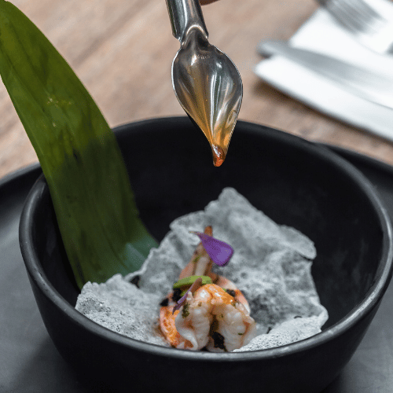

---
title: "A Chef's Journey to Becoming a Data Entrepreneur"
description: "My focus has always been to be an agent of change and an innovator. The transition from gastronomy to technology is a natural step in my career path and in my commitment to create solutions that can change the world for the better."
date: "2023-02-22"

categories:
  - "Data "
  - "First step"
keywords:
  - "Journey"
  - "Gastronomy"
  - "Transferable skills"
  - "Blog"
---


My focus has always been to be an agent of change and an innovator. The transition from gastronomy to technology is a natural step in my career path and in my commitment to create solutions that can change the world for the better

**Discovering the Power of Data**
Throughout my diverse experiences in the culinary world, I noticed a recurring theme – the power of data. Initially, I believed this ability was an innate gift, but I soon realized that interpreting, analyzing, and making data-driven decisions is a skill that must be learned, honed, and practiced.

I was fascinated by the potential of data to drive innovation and positive change in any industry, and I decided to fully dedicate myself to mastering this essential skill.

## Applying Data to the Culinary World

As a data-driven entrepreneur, I recognized the potential of data in the culinary world. I started by analyzing customer data to understand their preferences and identify opportunities for new menu items.

## First analisys

```css
import pandas as pd

# Load customer data
customer_data = pd.read_csv('customer_data.csv')

# Analyze customer preferences
popular_items = customer_data['favorite_menu_item'].value_counts()

# Visualize results
popular_items.plot.bar(title='Most Popular Menu Items')

```
By leveraging data, I was able to create new menu items that were highly popular with customers, driving revenue growth and customer satisfaction.

## Leveraging Data for Positive Change

My passion for data-driven decision making extends beyond the culinary world. I am eager to collaborate with like-minded professionals to find innovative solutions to the most pressing challenges facing industries worldwide.

I recently completed a course in machine learning and applied my new skills to predict customer churn in a telecommunications company.

```css
import numpy as np
import pandas as pd
from sklearn.model_selection import train_test_split
from sklearn.linear_model import LogisticRegression
from sklearn.metrics import accuracy_score

# Load customer data
customer_data = pd.read_csv('customer_data.csv')

# Preprocess data
X = customer_data.drop(['customer_id', 'churn'], axis=1)
X = pd.get_dummies(X)
y = customer_data['churn']

# Train/test split
X_train, X_test, y_train, y_test = train_test_split(X, y, test_size=0.3, random_state=42)

# Train logistic regression model
model = LogisticRegression()
model.fit(X_train, y_train)

# Make predictions on test set
y_pred = model.predict(X_test)

# Calculate accuracy
accuracy = accuracy_score(y_test, y_pred)

print('Model accuracy:', np.round(accuracy, 2))

```

This code analyzes customer data to predict which customers are likely to churn. By leveraging machine learning algorithms, we can develop targeted retention strategies to reduce churn and drive positive impacts for customers and stakeholders.

## First analisys

```css
import shutil

# Definimos los skills relevantes
skills_relevantes = ['strategic thinking', 'attention to detail', 'adaptability', 'creativity']

# Creamos la carpeta 'gastronomy' y agregamos los skills
carpeta_gastronomy = '/path/to/gastronomy'
for skill in skills_relevantes:
    shutil.copyfile(skill, f"{carpeta_gastronomy}/{skill}")

# Creamos la carpeta 'tech' y transferimos los skills relevantes
carpeta_tech = '/path/to/tech'
for skill in skills_relevantes:
    shutil.move(f"{carpeta_gastronomy}/{skill}", f"{carpeta_tech}/{skill}")
    
print('¡Skills transferidos exitosamente de la carpeta "gastronomy" a la carpeta "tech"!')

```
## Unlocking Limitless Potential: Embracing Passion and Vision as a Data-Driven Entrepreneur
My journey has been marked by challenges, growth, and self-discovery. From launching my own business to traveling to Mexico and Germany, I've learned invaluable lessons about entrepreneurship, leadership, and adaptability. Despite the obstacles I faced, I never lost sight of my passion for innovation and my desire to make a positive impact.

Now, as a data-driven entrepreneur, I am excited to apply my skills and expertise to drive positive change in the world. I believe that data is the key to unlocking limitless potential and solving some of the most pressing challenges facing our society. By combining my passion for innovation with my expertise in data-driven decision making, I am confident that I can make a difference and leave a lasting impact.


So, to those facing their own challenges or contemplating a new path in life, I urge you to embrace your passions, take risks, and never lose sight of your vision. With hard work, perseverance, and a commitment to ongoing learning and development, anything is possible. Let's create a better future together, one data-driven decision at a time.
